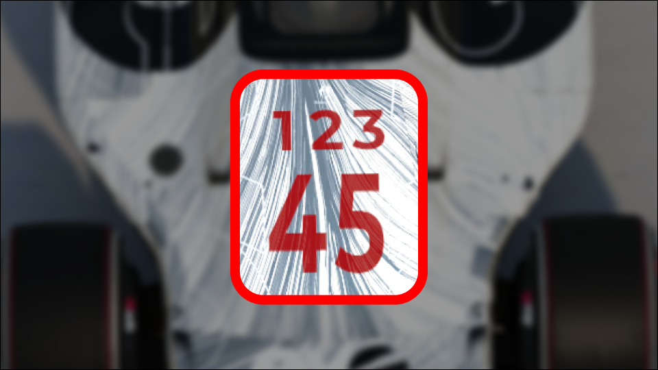

# DossardPlus
Customize the vehicle dossard!

# Singleplayer
You can customize the Trigram (3 letters), the Dossard numbers (2 letters) and color for the text.
Also an option to make them invisible, be vary that there might be some flicker when entering checkpoint or respawning.

# Multiplayer
You can only change the Trigram (3 letters) because of multiplayer scripts always changing the color and numbers for Dossard.

## Upcoming features.
* Scrolling text
* Rotating between different dossards
	* Intervals
* Rainbow colors
	* Speed

# Known bugs
* Dossard numbers changing when entering a checkpoint in singleplayer
* Possibility for Trigram to be overriden by a server and can cause flickering
	* Not tested yet, but will work towards a more reliable way of overriding Trigram.
